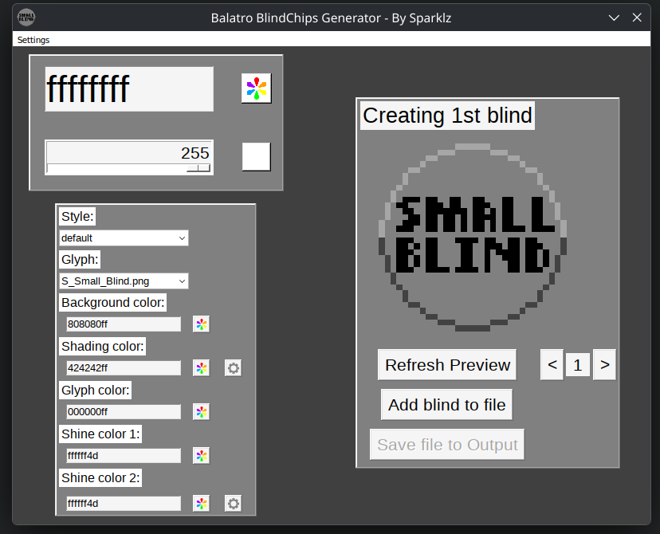

#  Balatro BlindChips Generator
This is a program (and files) for creating textures for boss blinds for mods for the game Balatro.

# Requirements
- The ability to read
# How to use
1. Go to the [latest release](https://github.com/Sparkly-Sparks/Balatro-BlindChips-Generator/releases/latest)
2. Download the Source code (zip).
3. Put the symbols for your blinds in the "Glyphs" folder.
4. Run BBG(GUI).exe.
5. Configure your blind and add to file. (Refreshing the preview and adding to file both take around 8 seconds.)
6. Save file to Output.
# Feedback
If you have anything to say about your experience, you may do so [here](https://discord.com/channels/1116389027176787968/1549759269425913917).
